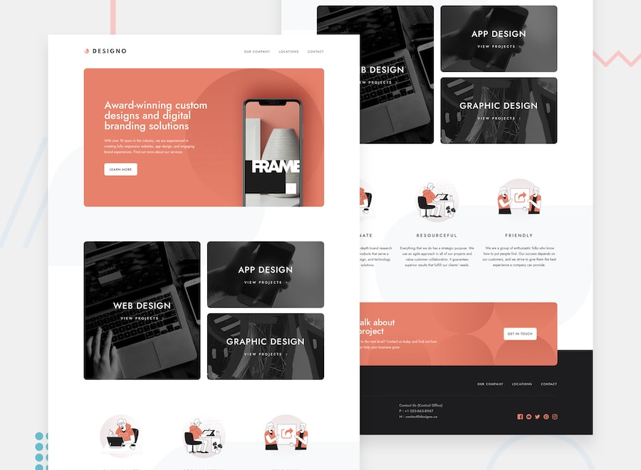

# Frontend Mentor - Designo agency website solution

This is a solution to the [Designo agency website challenge on Frontend Mentor](https://www.frontendmentor.io/challenges/designo-multipage-website-G48K6rfUT). Frontend Mentor challenges help you improve your coding skills by building realistic projects. 

## Table of contents

- [Overview](#overview)
  - [The challenge](#the-challenge)
  - [Preview](#preview)
  - [Links](#links)
- [My process](#my-process)
  - [Built with](#built-with)
  - [What I learned](#what-i-learned)
  - [Continued development](#continued-development)
- [Author](#author)

## Overview

### The challenge

Users should be able to:

- View the optimal layout for each page depending on their device's screen size
- See hover states for all interactive elements throughout the site
- Receive an error message when the contact form is submitted if:
  - The `Name`, `Email Address` or `Your Message` fields are empty should show "Can't be empty"
  - The `Email Address` is not formatted correctly should show "Please use a valid email address"

### Preview

### Links

- Live Site URL: [https://designo-website.vercel.app/](https://designo-website.vercel.app/)

## My process

### Built with

- Semantic HTML5 markup
- CSS custom properties and pseudo elements
- CSS Flexbox
- CSS Grid
- CSS modules
- Mobile-first workflow
- [React](https://reactjs.org/) - JS library
- [Next.js](https://nextjs.org/) - React framework
- [SASS](https://sass-lang.com/) - For styles
- [Typescript](https://www.typescriptlang.org/) - JS superset
- [React-hook-form](https://react-hook-form.com/) - For Form

### What I learned

- First time working with forms, react hook form is so dead simple. Specifically for us that love typescript.
- First COMPLETE project using Next.js, i really liked it and probably it's the future.

### Continued development

I'm gonna continue my to learn more about the react ecosystem. It's so big and you have so many choices. I'm working in two react projects right now without next.js (but i plan to recreate them using next.js) and a lot of libaries to help me out.

## Author

- Website - SOON
- Frontend Mentor - [@Galielo-App](https://www.frontendmentor.io/profile/Galielo-App)
